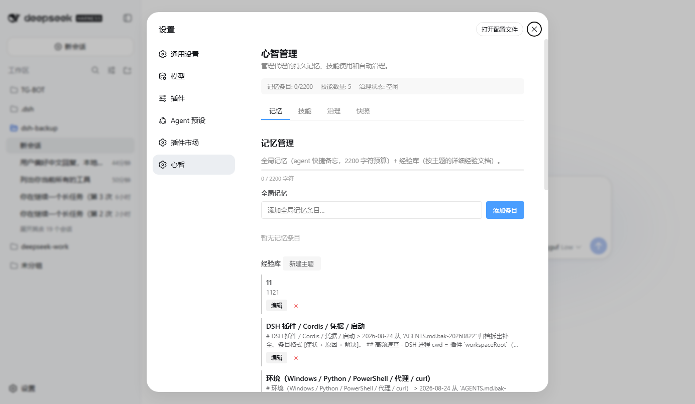
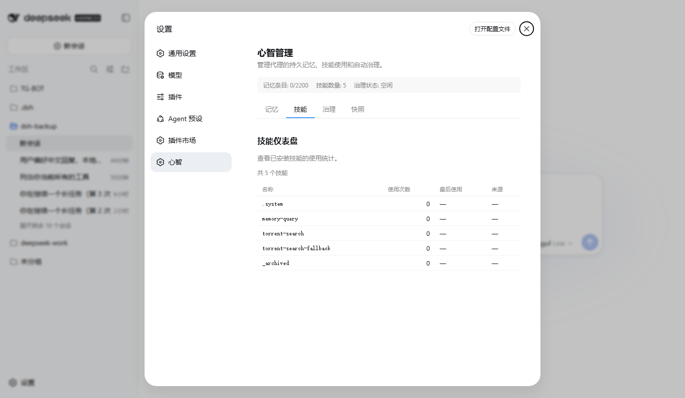
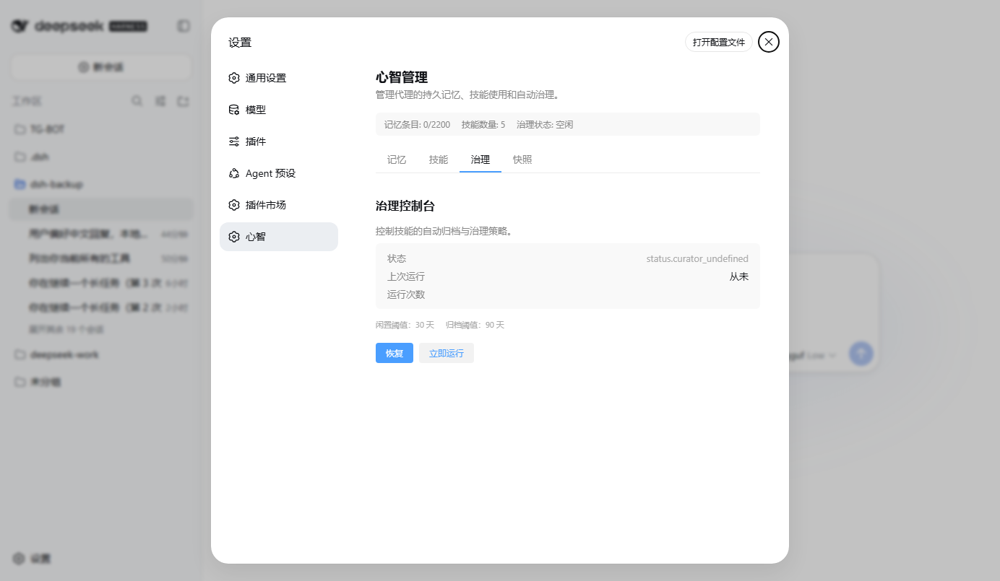
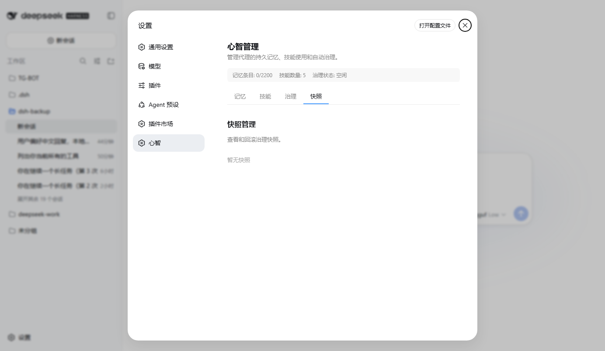

# dsh-mind

> 给 DSH agent 装个脑子——持久记忆、经验库、技能自管理。

一个 DSH bundle：给任意 agent profile 加**跨会话记忆**和**技能生命周期管理**。数据全部本地存储，不依赖任何外部服务。

**[English](./README.md)**

## 功能

| 能力 | 说明 |
|---|---|
| **便签** | agent 用 `memory` 工具读写的快捷备忘（`MEMORY.md`，2200 字符预算），GUI/CLI 也能管 |
| **经验库** | 你按主题整理的 Markdown 文件（`comfyui.md`、`dsh.md`…）自动出现在 GUI，agent 可搜索 |
| **技能使用追踪** | 记录技能何时被使用、用了多少次 |
| **技能治理** | 自动归档过期技能（30 天→stale，90 天→archived），带快照与回滚 |
| **CLI** | `dsh-mind status / run / archive / restore / memory / install-preset ...` |
| **Web GUI** | 完整记忆管理器、技能仪表盘、治理控制台（DSH Web 插件，中/英） |
| **预设** | 一键安装 agent 预设（全开或轻量） |

## 截图

| 记忆管理器 | 技能仪表盘 |
|---|---|
|  |  |
| **治理控制台** | **快照管理** |
|  |  |

## 记忆体系（为什么 AGENTS.md ≠ 便签 ≠ 经验库）

agent 有三类知识，别搞混：

| 层 | 文件 | 比喻 | 加载方式 | 谁能写 |
|---|---|---|---|---|
| **必背指令** | `~/.dsh/AGENTS.md` | 操作手册 + 笔记本索引 | **每会话自动加载** | 你（静态） |
| **便签** | `~/.dsh/memory/MEMORY.md` | agent 的快捷备忘（2200 字符预算） | agent 按需读 | agent / 面板 / CLI |
| **经验库** | `~/.dsh/memory/*.md` | 你整理的主题资料 | 关键词搜索 | 你（维护文档） |

一句话：**AGENTS.md = 一直带着的指令；便签 = agent 自己写的备忘；经验库 = 你要查的详细资料。**
AGENTS.md 在插件的面板之外——它每个会话自动加载。


## 快速开始

```bash
dsh plugin --profile web add @wumihaze/dsh-mind
```

装完即可用，四类能力：

**1. 便签** —— agent 的快捷备忘

```bash
dsh-mind memory add "用户偏好简洁回复"
dsh-mind memory search "偏好"
dsh-mind memory list
```

会话里 agent 也能自己读写：`memory list` / `memory search <关键词>` / `memory add <内容>` / `memory replace` / `memory remove`。

**2. 经验库** —— 你已有的主题记忆自动接入

dsh-mind 自动读取 `~/.dsh/memory/` 下所有 Markdown（`comfyui.md`、`dsh.md`、`prefs.md`…），在 GUI 里列出。agent 的 `memory search` 能搜进这些文件内容——和你 `memory-query` 技能检索的是同一份库。

**3. 技能治理** —— 管理技能（`~/.dsh/skills/` 下的目录）

```bash
dsh-mind list                    # 列出所有技能
dsh-mind archive code-review     # 归档技能（agent 不再加载它）
dsh-mind restore code-review     # 恢复已归档技能
dsh-mind status                  # 查看治理状态
```

**4. Web GUI** —— 打开 **设置 → 心智**，面板分两层：

- **便签** —— agent 的快捷备忘，可添加/编辑/删除。
- **经验库** —— 你的主题文件，可查看/编辑/删除/新建。

## 安装

```bash
# 从 npm
dsh plugin --profile web add @wumihaze/dsh-mind

# 从本地源码
dsh plugin --profile web add ./dsh-mind
```

> **升级注意**：执行 `dsh plugin add` 前请**先停掉 DSH Web**，装完再启动——pnpm 会在 app 运行时替换包文件，可能和 app 内部的模块热重载竞态。停 → 装/升级 → 启。

### Agent 能力默认开启

自 **0.1.22** 起，所有能力都注册在 **host 层**，装完 bundle 即对**每个 agent**生效，不需要装预设：

- `memory` 工具（便签 + 经验库检索）
- `skill_manage` 工具
- `memory-nudge`（记忆提醒）和 `memory-guidance`（使用引导）
- skill-usage 遥测、curator-core 治理、Web GUI 面板

旧的 `mind-active` / `mind-light` 预设仅作兼容保留，不再提供额外功能。

> **从 ≤ 0.1.21 升级**：如果你之前装过 `mind-active` / `mind-light`（或把 agent 行合并进自定义预设），现在请把预设里的这些行清掉——能力已是 host 层，保留会重复注册导致 nudge 提醒翻倍。
>
> 想对特定 agent 关闭 dsh-mind，在 profile 的 `cordis.patch.yml` 里禁用对应行（如给 `memory-nudge` 或 `tool-memory` 加 `disabled: true`）。

## Agent 工具

每个 agent 默认都有这两个工具：

| 工具 | 动作 | 后端存储 |
|---|---|---|
| `memory` | `list` / `search` / `add` / `replace` / `remove` | `~/.dsh/memory/MEMORY.md`（便签）+ 搜索 `~/.dsh/memory/*.md`（经验库） |
| `skill_manage` | `create` / `patch` / `delete` | `~/.dsh/skills/` |

`memory-nudge` 在有值得注意的事后提醒 agent 复习记忆，直到它下一次真正写入记忆（或技能）——写了就停止提醒。

## CLI 参考

```bash
# 治理管理
dsh-mind status              # 查看治理状态和技能摘要
dsh-mind run                 # 执行一轮治理（启发式）
dsh-mind pause               # 暂停自动治理
dsh-mind resume              # 恢复自动治理
dsh-mind archive <name>      # 归档技能
dsh-mind restore <name>      # 恢复已归档技能
dsh-mind list                # 列出所有技能
dsh-mind snapshots           # 查看快照列表
dsh-mind rollback <id>       # 回滚到指定快照
dsh-mind prune --days 30     # 清理 N 天前的旧快照

# 记忆管理
dsh-mind memory add <内容>        # 添加一条便签
dsh-mind memory search <关键词>   # 搜索记忆
dsh-mind memory list              # 列出所有记忆

# 预设管理
dsh-mind install-preset [name]    # 安装预设（不带名字：列出可用）
dsh-mind uninstall-preset <name>  # 移除预设
```

退出码：`0` = 成功，`1` = 失败，`2` = 参数错误

## 架构

```
┌───────────────────────────────────────────────────────────────┐
│  dsh-mind (bundle)                                             │
│                                                               │
│  Host 层（cordis.patch.yml 自动注册）                          │
│  ┌──────────────┐  ┌──────────────┐  ┌───────────────┐        │
│  │ skill-usage  │  │ curator-core │  │ dsh-mind-web  │        │
│  │ (追踪)       │  │ (治理)       │  │ (GUI 路由)    │        │
│  └──────────────┘  └──────────────┘  └───────────────┘        │
│                                                               │
│  Agent 能力（host 层，默认开启）                                          │
│  ┌───────────┐  ┌───────────────┐  ┌───────────┐  ┌────────┐ │
│  │ memory-   │  │ memory-       │  │ memory    │  │ skill- │ │
│  │ nudge     │  │ guidance      │  │ tool      │  │ manage │ │
│  └───────────┘  └───────────────┘  └───────────┘  └────────┘ │
│                                                               │
│  CLI（独立 bin，零外部依赖）                                   │
│  ┌─────────────────────────────────────────────────────────┐  │
│  │ dsh-mind status / run / archive / memory / preset        │  │
│  └─────────────────────────────────────────────────────────┘  │
│                                                               │
│  数据存储（~/.dsh/）                                          │
│  ┌─────────────────────────────────────────────────────────┐  │
│  │ memory/（便签 MEMORY.md + 经验库 *.md）  skills/      │  │
│  │ curator/  skill-usage/                                  │  │
│  └─────────────────────────────────────────────────────────┘  │
└───────────────────────────────────────────────────────────────┘
```

## 配置参考

| 参数 | 默认 | 说明 |
|---|---|---|
| `staleAfterDays` | 30 | 技能 N 天未用标记为 stale |
| `archiveAfterDays` | 90 | 技能 N 天未用自动归档 |
| `intervalDays` | 7 | 治理检查间隔（天） |
| `minIdleMinutes` | 120 | 空闲 N 分钟后触发治理 |
| `intervalTurns`（nudge） | 8 | 每 N 轮对话提醒复习记忆 |
| `budget`（memory 工具） | 2200 | 便签字符预算 |

**在哪配置**：编辑 profile 的 `cordis.patch.yml` 里的 `config`（curator-core），或预设的 `agent.cordis.yml`（memory-nudge、tool-memory）。

## 数据位置

所有数据在 `~/.dsh/` 下：

```
~/.dsh/
├── memory/                    # 记忆
│   ├── MEMORY.md              #   便签（快捷备忘，2200 字符预算）
│   ├── comfyui.md             #   经验库（按主题的详细文档，你已有的）
│   ├── dsh.md                 #   …
│   └── prefs.md               #   …
├── skills/                    # 活动技能
│   └── <name>/SKILL.md
├── skills/_archived/          # 已归档技能
├── skills/.system/curator/state.json      # 治理状态
├── skills/.system/curator/snapshots/      # 治理快照
└── skills/.system/curator/usage.json      # 技能使用记录
```

卸载 bundle **不会**删除数据。

## 环境要求

- DSH ≥ 0.1.1-rc
- Node.js ≥ 20

## FAQ

**数据存在哪？**
全部在 `~/.dsh/` 本地。无云、无外部服务。记忆就是纯 Markdown，可以直接读改。

**便签和经验库的区别？**
- **便签**（`memory/MEMORY.md`）：agent 用 `memory` 工具读写的短备忘（2200 字符预算）。GUI 面板、CLI、agent 三方同管。
- **经验库**（`memory/*.md`）：你按主题整理的详细经验文档。agent 的 `memory search` 和你 `memory-query` 技能都能检索。

**卸载会丢数据吗？**
不会。`dsh plugin remove dsh-mind` 只移除 bundle，`~/.dsh/` 下数据都保留。重装即恢复。

**和 Letta（MemGPT）有什么区别？**
Letta 是带服务端记忆的完整 agent 框架。dsh-mind 是轻量 DSH bundle：无服务、无数据库、文件存储，融入现有 DSH agent 而不是替代它。"记忆即文件" vs "记忆即服务"。

**agent 会记住一切吗？**
便签有 2200 字符预算，agent 会被提醒去精简，保留最有价值的事实。经验库无预算，放你整理的主题文档。

**归档的技能会怎样？**
移到 `~/.dsh/skills/_archived/<name>/`，不再加载进技能列表，随时 `dsh-mind restore <name>` 恢复。

**为什么不自动提取记忆 / 直接注入提示词？**
dsh-mind 的记忆是**工具式 + agent 主动**的：agent 用 `memory` 工具读写便签，`memory-nudge` 在有事发生后提醒它复习。这是刻意选择——保持上下文精简（2200 预算）、不加额外 LLM 调用、不膨胀提示词。部分 DSH 记忆插件会**对话后自动提取**事实，或**每轮直接注入记忆**进提示词（无需调工具即可回忆）。那更自动，但更费 token 和上下文。dsh-mind 走轻量、省预算的路子。

**Web GUI 会跟随语言吗？**
会，面板中/英双语，跟随 DSH app 语言。

**支持 Windows 吗？**
支持。路径用 `path.join`、写入原子化（rename）、处理 CRLF。已在 Windows 11 测试。

## License

[MIT](./LICENSE)
